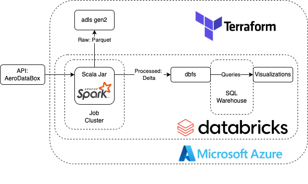
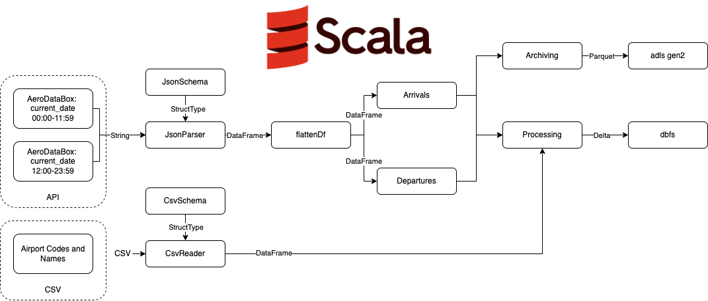

## Table of Contents
- [Project Overview](#project-overview)
  - [Objectives](#objectives)
- [Data Source](#data-source)
  - [API Selection](#api-selection)
- [Architecture](#architecture)
  - [Pipeline Infrastructure](#pipeline-infrastructure)
  - [Design Choices](#design-choices)
- [Scala Application](#scala-application)
  - [Application Flow](#application-flow)
- [Output Data](#output-data)
  - [Schemas](#schemas)
  - [Design Choices](#design-choices-1)

# Project Overview
This project focuses on creating a basic data pipeline on Azure, designed to feed a dashboard with arrival and departure details for a specific airport.  
 
This project serves to concretize my theoretical knowledge on terraform, databricks, azure, scala and spark.  
 

**Note: In a Real-World Project you would not use spark to process the limited amount of data that is ingested from the API but rather use something like pandas which doesn't utilize distributed computing.**

## Objectives
- Display current daily arrival and departure information for Schiphol Airport.
- Use an API for data sourcing
- Run the project on Azure
- Implement Terraform for IaC.
- Use Azure Databricks for computation and visualization tasks

# Data Source
To source current and accurate data, an API was used. The criteria of requiring only daily updates allowed for the consideration of free APIs offering a limited number of monthly requests.

## API Selection
<b>AviationStack</b>
Initially, AviationStack was selected for its free tier, capable of providing detailed information on either departures or arrivals at a chosen airport, with a limit of 100 requests per month. However, the limit was quickly reached during testing, indicating a need for a more efficient approach in future development, such as using sample requests during code development before making actual API calls.

<b>AeroDataBox</b>
Ultimately, AeroDataBox was chosen for the data pipeline due to its affordable minimum tier at $1/month, offering 300 requests sufficient for the project's needs. This API advantageously combines both arrival and departure data in a single request, although it limits data retrieval to a 12-hour span, necessitating two requests per day. This usage pattern allows for approximately 62 requests per airport each month, enabling the inclusion of up to four airports within the limit, in contrast to AviationStack's capacity for just one. This scalability provides potential for expansion.  

# Architecture

Figure 1: Infrastructure

## Pipeline Infrastructure

As stated in the project description, this project aims to use terraform, azure, databrick, and scala. The chosen infrastrucure design is shown in Figure 1 and can be summarized as follows:  
 

1. Scala .jar running as Databricks job ingests data from API
2. Raw API data is stored in adls gen2 as .parquet
3. Data is processed by .jar
4. Processed data is stored in dbfs
5. From dbfs a databricks SQL warehouse queries data for visualization
6. Data is visualized in a databricks dashboard

## Design Choices

Here some main design choices are highlightede: 

### Job Cluster Pool

During testing, a Databricks cluster pool was used to reserve Azure computing resources, speeding up job executions. While Databricks itself doesn't charge for the cluster pool, the underlying Azure VMs do incur costs. This approach enhanced testing efficiency. However, for the final pipeline without concurrent job runs, the cluster pool was not implemented to reduce costs.

### Serverless SQL Warehouse

Serverless is the most expensive SQL warehouse option on databricks if you look at a price per dbu perspective. It is 3.5 times more expensive per dbu than a classic SQL warehouse [(source: Databricks)](https://www.databricks.com/product/pricing/databricks-sql). However, since it is a lot faster at turning on and switching off this has to be taken into account. 
<b>To be tested:</b>

# Scala Application

## Application Flow

The scala application that runs on databricks is structured as follows: 

### API Data

1. Two API calls are made that span the current day and saved in a String
2. The string is parsed into a dataframe using a mirror of the schema in StructType format
3. The DataFrame is flattened and split into arrival and departure data
4. The arrival and departure dataframes are archived to adls gen2 storage in parquet format

### Airport Codes and Names

1. Airport Codes and Names csv stored in adls is read into dataframe using a mirror of the schema in StructType format

### Processing and Serving

1. The API data is aggregated and processed
2. The API data is enriched with the full names of the airports as defined in the csv file
3. The gold data is stored in dbfs in delta lake format

# Output Data

## Schemas

### Archive Data

<b>location:</b>   
`abfss://...@....dfs.core.windows.net/archive/{airportIcao}/{departure/arrival}.parquet`

<b>Schema:</b>

| Column Name                           | Description                                                                 |
|---------------------------------------|-----------------------------------------------------------------------------|
| `movement_airport_icao`               | The ICAO code for the departure airport.                                    |
| `movement_airport_iata`               | The IATA code for the departure airport.                                    |
| `movement_airport_localCode`          | The local code for the departure airport.                                   |
| `movement_airport_name`               | The full name of the departure airport.                                     |
| `movement_airport_shortName`          | The short name of the departure airport.                                    |
| `movement_airport_municipalityName`   | The municipality in which the airport is located.                           |
| `movement_airport_location_lat`       | Latitude of the departure airport.                                          |
| `movement_airport_location_lon`       | Longitude of the departure airport.                                         |
| `movement_airport_countryCode`        | The country code of the departure airport.                                  |
| `movement_scheduledTime_utc`          | Scheduled departure time in UTC.                                            |
| `movement_scheduledTime_local`        | Scheduled departure time in local timezone.                                 |
| `movement_revisedTime_utc`            | Revised departure time in UTC, if any.                                      |
| `movement_revisedTime_local`          | Revised departure time in local timezone, if any.                           |
| `movement_runwayTime_utc`             | Actual runway departure time in UTC.                                        |
| `movement_runwayTime_local`           | Actual runway departure time in local timezone.                             |
| `movement_terminal`                   | Departure terminal.                                                         |
| `movement_checkInDesk`                | Check-in desk numbers.                                                      |
| `movement_gate`                       | Departure gate.                                                             |
| `movement_baggageBelt`                | Baggage belt for the flight.                                                |
| `movement_runway`                     | Runway used for departure.                                                  |
| `movement_quality`                    | Quality indicator for the movement data.                                    |
| `departure_number`                    | Flight number.                                                              |
| `departure_callSign`                  | Call sign of the flight.                                                    |
| `departure_status`                    | Current status of the departure.                                            |
| `departure_codeshareStatus`           | Codeshare status of the flight.                                             |
| `departure_isCargo`                   | Indicates if the flight is carrying cargo.                                  |
| `aircraft_reg`                        | Registration number of the aircraft.                                        |
| `aircraft_modeS`                      | Mode-S transponder code of the aircraft.                                    |
| `aircraft_model`                      | Model of the aircraft.                                                      |
| `aircraft_image_url`                  | URL to an image of the aircraft.                                            |
| `aircraft_image_webUrl`               | Web URL for the aircraft image.                                             |
| `aircraft_image_author`               | Author of the aircraft image.                                               |
| `aircraft_image_title`                | Title of the aircraft image.                                                |
| `aircraft_image_description`          | Description of the aircraft image.                                          |
| `aircraft_image_license`              | License type for the aircraft image.                                        |
| `aircraft_image_htmlAttributions`     | HTML attributions for the aircraft image.                                   |
| `airline_name`                        | Name of the airline.                                                        |
| `airline_iata`                        | IATA code of the airline.                                                   |
| `airline_icao`                        | ICAO code of the airline.                                                   |

### Gold Table: Daily Departure/Arrival Count

<b>location:</b>   
`dbfs://{airportIcao}_{departures/arrivals}_count.delta`

<b>Schema:</b>
| Column Name     | Description                                                  |
|-----------------|--------------------------------------------------------------|
| `airport_iata`  | The IATA code identifying the airport.                       |
| `count`         | The number of flights associated with the respective data.   |
| `isCargo`       | Boolean indicating if the flight is carrying cargo.          |
| `flight_date`   | The date of the flight.                                      |
| `airport_name`  | The name of the airport.                                     |

## Design Choices

### Storage of Raw Data

The raw data is stored in an Azure Data Lake Storage (ADLS) Gen2 account, organized into separate folders for each airport. Within these folders, data for arrivals and departures are kept in distinct files, facilitating efficient filtering by airport and then by type of flight (arrival/departure). The chosen file format is Parquet, utilizing Snappy compression for its balance of compression chosen for its efficient storage. 

### Storage of "Gold" Data

Aggregated data tables are stored in Databricks File System (DBFS), making them easily accessible for querying and visualization within Databricks. This data is stored in the Delta Lake format, which provides ACID transaction support, adding an extra layer of data integrity and reliability to the Parquet storage format.

# Future Changes
