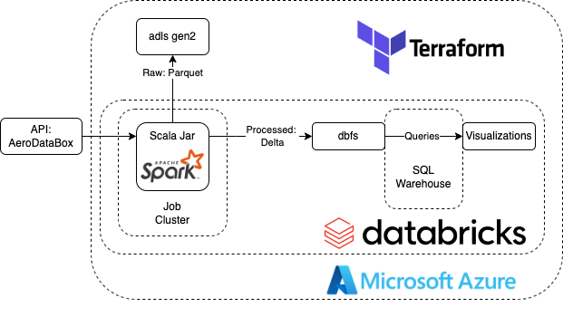

<h1>Architecture</h1>

Figure 1: Infrastructure

<h2>Pipeline Infrastructure Overview</h2>

As stated in the project description, this project aims to use terraform, azure, databrick, and scala. The chosen infrastrucure design is shown in Figure 1 and can be summarized as follows:  
 

1. Scala .jar running as Databricks job ingests data from API
2. Raw API data is stored in adls gen2 as .parquet
3. Data is processed by .jar
4. Processed data is stored in dbfs
5. From dbfs a databricks SQL warehouse queries data for visualization
6. Data is visualized in a databricks dashboard

<h2>Design Choices</h2>

Here some main design choices are highlightede: 

<h3>Job Cluster Pool</h3>

During testing, a Databricks cluster pool was used to reserve Azure computing resources, speeding up job executions. While Databricks itself doesn't charge for the cluster pool, the underlying Azure VMs do incur costs. This approach enhanced testing efficiency. However, for the final pipeline without concurrent job runs, the cluster pool was not implemented to reduce costs.

<h3>Serverless SQL Warehouse</h3>

Serverless is the most expensive SQL warehouse option on databricks if you look at a price per dbu perspective. It is 3.5 times more expensive per dbu than a classic SQL warehouse [(source: Databricks)](https://www.databricks.com/product/pricing/databricks-sql). However, since it is a lot faster at turning on and switching off this has to be taken into account. 
<b>To be tested:</b>